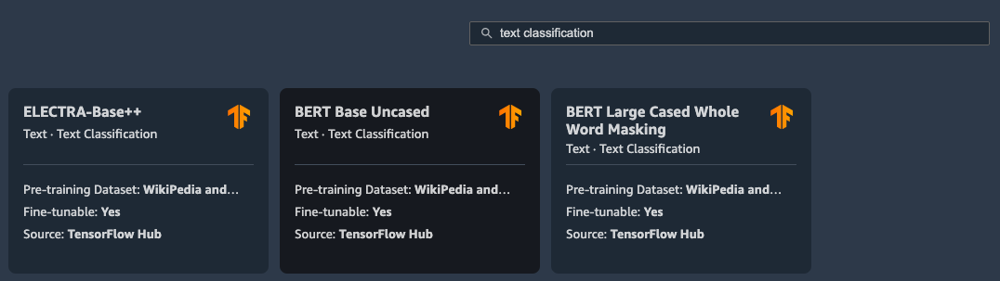
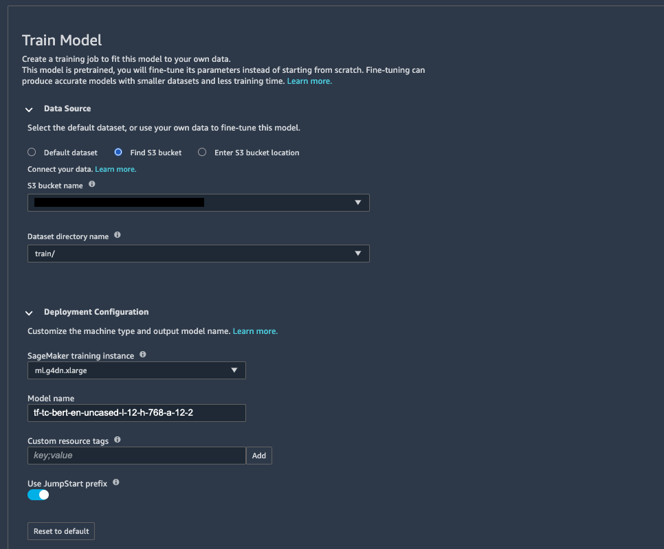

# Multi-label classification using `AutoGluon`

From their [official website](https://auto.gluon.ai/stable/index.html):
> AutoGluon enables easy-to-use and easy-to-extend AutoML with a focus on automated stack ensembling, deep learning, and real-world applications spanning image, text, and tabular data. Intended for both ML beginners and experts, AutoGluon enables you to:
> - Quickly prototype deep learning and classical ML solutions for your raw data with a few lines of code.
> - Automatically utilize state-of-the-art techniques (where appropriate) without expert knowledge.
> - Leverage automatic hyperparameter tuning, model selection/ensembling, architecture search, and data processing.
> - Easily improve/tune your bespoke models and data pipelines, or customize AutoGluon for your use-case.

In this repository we are going to see an example of how to take a sample input, pre-process it to convert it to the right format, train different algorithms and evaluate their performance, and perform inference on a validation sample. The input dataset won't be made available but, as a guideline, it follows the structure below:

| Case Details | Category | Subcategory | Sector | Tag    |
|--------------|----------|-------------|--------|--------|
| Sentence 1   | A        | AA          | S01    | Double |
| Sentence 2   | B        | BA          | S01    | Mono   |
| ...          | ...      | ...         | ...    | ...    |
| Sentence N   | Z        | ZZ          | S99    | Mono   |

## Getting started
- [SageMaker StudioLab Explainer Video](https://www.youtube.com/watch?v=FUEIwAsrMP4)
- [AutoGluon Documentation](https://auto.gluon.ai/stable/index.html)
- [New built-in Amazon SageMaker algorithms for tabular data modeling: LightGBM, CatBoost, AutoGluon-Tabular, and TabTransformer](https://aws.amazon.com/blogs/machine-learning/new-built-in-amazon-sagemaker-algorithms-for-tabular-data-modeling-lightgbm-catboost-autogluon-tabular-and-tabtransformer/)
- [Run text classification with Amazon SageMaker JumpStart using TensorFlow Hub and Hugging Face models](https://aws.amazon.com/blogs/machine-learning/run-text-classification-with-amazon-sagemaker-jumpstart-using-tensorflow-hub-and-huggingface-models/)

## Step by step tutorial

### Setup your environment

First, you need to get a [SageMaker Studio Lab](https://studiolab.sagemaker.aws/) account. This is completely free and you don't need an AWS account. Because this new service is still in Preview and AWS is looking to reduce fraud (e.g. crypto mining), you will need to wait 1-3 days for your account to be approved. You can see [this video](https://www.youtube.com/watch?v=FUEIwAsrMP4&ab_channel=machinelearnear) for more information.

Now that you have your Studio Lab account, you can follow the steps shown in `data_prep_train_eval.ipynb` > [](https://studiolab.sagemaker.aws/import/github/machinelearnear/multi-label-classification-autogluon/blob/main/data_prep_train_eval.ipynb)

Click on `Copy to project` in the top right corner. This will open the Studio Lab web interface and ask you whether you want to clone the entire repo or just the Notebook. Clone the entire repo and click `Yes` when asked about building the `Conda` environment automatically. You will now be running on top of a `Python` environment with `AutoGluon` and other dependencies installed.

### Data preparation

Following the example shown in this [AWS blog post](https://aws.amazon.com/blogs/machine-learning/run-text-classification-with-amazon-sagemaker-jumpstart-using-tensorflow-hub-and-huggingface-models/), we are looking to go from the initial dataset structure into a single label to be predicted and a single column as input sentence.

> Text classification

> Sentiment analysis is one of the many tasks under the umbrella of text classification. It consists of predicting what sentiment should be assigned to a specific passage of text, with varying degrees of granularity. Typical applications include social media monitoring, customer support management, and analyzing customer feedback.

> The input is a directory containing a data.csv file. The first column is the label (an integer between 0 and the number of classes in the dataset), and the second column is the corresponding passage of text. This means that you could even use a dataset with more degrees of sentiment than the original—for example, very negative (0), negative (1), neutral (2), positive (3), very positive (4). The following is an example of a data.csv file corresponding to the SST2 (Stanford Sentiment Treebank) dataset, and shows values in its first two columns. Note that the file shouldn’t have any header.

|Column 1|Column 2|
|:----|:----|
|0|hide new secretions from the parental units|
|0|contains no wit , only labored gags|
|1|that loves its characters and communicates something rather beautiful about human nature|
|0|remains utterly satisfied to remain the same throughout|
|0|on the worst revenge-of-the-nerds clichés the filmmakers could dredge up|
|0|that ‘s far too tragic to merit such superficial treatment|
|1|demonstrates that the director of such hollywood blockbusters as patriot games can still turn out a small , personal film with an emotional wallop .|

```python
# prepare for training
df_sector.columns = ['sentence','label']
df_sector = df_sector[['label','sentence']]
codes, uniques = pd.factorize(df_sector['label'])
df_sector['label'] = codes

# print labels and codes
for x,y in zip(df_sector['label'].unique(), uniques.values):
    print(f'{x} => "{y}"')
    
# save to disk
df_sector.to_csv('data/data_sector.csv', index=False)
```

Looking at samples in the raw dataset, each grouping (e.g., "Case") can be linked to one or more categories and to one or more subcategories, creating hundreds of variations. As a result, we treat the problem of predicting "Category" and "Subcategory" as a multi-label classification problems where each "Case" can have one or more categories as labels and one or more subcategories.
 
The first step is to transform our dataset and create a label for each one of the categories we have. Next, for each sample we assign a `0` or `1` to each label column depending on whether the "Case" belongs to that category or not.

```python
# prepare for training
df_category = df.dropna(subset=['Category'])
df_category = df_category.drop(['Sector', 'Subcategory', 'Tag'], axis=1)
 
 
df_category=df_category.pivot_table(index='Case Details', columns=['Category'], aggfunc=len,fill_value=0)
 
df_category['sentence'] = df_category.index
df_category.reset_index(drop=True, inplace=True)
df_category= df_category.rename(columns=str.lower)
df_category.shape
```
 
We follow the same approach for subcategories.

### Model training

#### Predict single label using `TabularPredictor`
- https://auto.gluon.ai/scoredebugweight/api/autogluon.task.html#autogluon.tabular.TabularPredictor

```python
from autogluon.tabular import TabularPredictor
time_limit = 1 * 60 * 60
pred_sector = TabularPredictor(label='label', path='pred_sector')
pred_sector.fit(df_sector, hyperparameters='multimodal', time_limit=time_limit)
```

Once the training is finished, you can view a leaderboard with results across different algorithms

```python
leaderboard = pred_sector.leaderboard(df_sector)
leaderboard.to_csv('data/leaderboard.csv',index=False)
leaderboard.head(10)
```


| model               | score_test | score_val  | pred_time_test | pred_time_val | fit_time   | pred_time_test_marginal | pred_time_val_marginal | fit_time_marginal | stack_level | can_infer | fit_order |
| ------------------- | ---------- | ---------- | -------------- | ------------- | ---------- | ----------------------- | ---------------------- | ----------------- | ----------- | --------- | --------- |
| WeightedEnsemble_L2 | 0.96294896 | 0.83967936 | 4.62426472     | 1.03646231    | 254.271195 | 0.22828174              | 0.00050831             | 0.28966641        | 2           | TRUE      | 9         |
| VowpalWabbit        | 0.95803403 | 0.79158317 | 0.73444152     | 0.11314583    | 5.56324816 | 0.73444152              | 0.11314583             | 5.56324816        | 1           | TRUE      | 6         |
| LightGBM            | 0.95614367 | 0.78356713 | 0.11071897     | 0.01948977    | 7.96716714 | 0.11071897              | 0.01948977             | 7.96716714        | 1           | TRUE      | 1         |
| XGBoost             | 0.95387524 | 0.76953908 | 0.17194605     | 0.02701616    | 9.91046214 | 0.17194605              | 0.02701616             | 9.91046214        | 1           | TRUE      | 4         |
| LightGBMLarge       | 0.95311909 | 0.76553106 | 0.92347479     | 0.12258124    | 22.6849813 | 0.92347479              | 0.12258124             | 22.6849813        | 1           | TRUE      | 7         |
| TextPredictor       | 0.95236295 | 0.82364729 | 3.30338812     | 0.82069683    | 162.585056 | 3.30338812              | 0.82069683             | 162.585056        | 1           | TRUE      | 8         |
| LightGBMXT          | 0.94744802 | 0.78156313 | 0.11619425     | 0.01983976    | 7.22314429 | 0.11619425              | 0.01983976             | 7.22314429        | 1           | TRUE      | 2         |
| CatBoost            | 0.8415879  | 0.76553106 | 0.10149503     | 0.05197072    | 63.9656713 | 0.10149503              | 0.05197072             | 63.9656713        | 1           | TRUE      | 3         |
| NeuralNetTorch      | 0.32400756 | 0.28657315 | 0.0297451      | 0.01081109    | 6.67724204 | 0.0297451               | 0.01081109             | 6.67724204        | 1           | TRUE      | 5         |

#### Predict single label using `TextPredictor`
- https://auto.gluon.ai/stable/tutorials/tabular_prediction/tabular-multimodal-text-others.html#improve-the-performance-with-stack-ensemble
- https://auto.gluon.ai/stable/tutorials/text_prediction/customization.html

`TextPredictor` provides several simple preset configurations. Let’s take a look at the available presets.

```python
from autogluon.text.text_prediction.presets import list_text_presets
list_text_presets(verbose=True)
```

Split your data into `train` and `test`

```python
train_data = df_sector.sample(frac=0.9, random_state=42)
test_data = df_sector.drop(train_data.index)
label = "label"
y_test = test_data[label]
X_test = test_data.drop(columns=[label])
```

And begin your model training

```python
from autogluon.text import TextPredictor
time_limit = 1 * 60 * 60
pred_sector_textpred = TextPredictor(eval_metric="acc", label="label")
pred_sector_textpred.fit(
    train_data=train_data,
    presets="best_quality",
    time_limit=time_limit,
)
```

Once this is finished, you can evaluate against your test data

```python
pred_sector_textpred.evaluate(test_data, metrics=["f1", "acc"])
```

#### Predict `Category` and `Subcategory` (Multi-label Classification)
With `AutoGluon`, we can have a separate [`TabularPredictor`](https://auto.gluon.ai/stable/api/autogluon.predictor.html#autogluon.tabular.TabularPredictor.fit) for each column we want to predict and use a custom MultilabelPredictor class to manage the collection of TabularPredictor objects. With this in mind, we create a `MultiLabelPredictor` class similar to the one described in the `AutoGluon` documentation here. We then apply our `MultiLabelPredictor` to predict the category and subcategory labels for each Case.
 
First, we split the data into train and test and use the train data for training. Here is an example of how we train the model to predict Categories.
 
```python
from MultilabelPredictor import MultilabelPredictor
 
labels = [f'{x}' for x in category_train_data.columns]
labels.remove('sentence')
save_path='models'
cat_multi_predictor = MultilabelPredictor(labels=labels, path=save_path)
cat_multi_predictor.fit(category_train_data)
```

Once the training is finished, we can see the results for different algorithms. `LightGBM` and  `WeightedEnsemble_L2` have the best performance when predicting "Category" in our case.

```
Fitting model: CatBoost ...
         0.9219    = Validation score   (accuracy)
         22.61s    = Training   runtime
         0.01s     = Validation runtime
Fitting model: ExtraTreesGini ...
         0.8586    = Validation score   (accuracy)
         1.72s     = Training   runtime
         0.1s      = Validation runtime
Fitting model: ExtraTreesEntr ...
         0.8608    = Validation score   (accuracy)
         1.44s     = Training   runtime
         0.1s      = Validation runtime
Fitting model: XGBoost ...
         0.9325    = Validation score   (accuracy)
         2.72s     = Training   runtime
         0.01s     = Validation runtime
Fitting model: NeuralNetTorch ...
         0.9219    = Validation score   (accuracy)
         2.89s     = Training   runtime
         0.02s     = Validation runtime
Fitting model: LightGBMLarge ...
         0.9198    = Validation score   (accuracy)
         5.81s     = Training   runtime
         0.03s     = Validation runtime
Fitting model: WeightedEnsemble_L2 ...
         0.9325    = Validation score   (accuracy)
         0.77s     = Training   runtime
         0.0s      = Validation runtime
```

We can also view the leaderboard that shows the performance of each algorithm when predicting a specific column. Here is an example for “XYZ”:

| |model|score_val|pred_time_val|fit_time|pred_time_val_marginal|fit_time_marginal|stack_level|can_infer|
|:----|:----|:----|:----|:----|:----|:----|:----|:----|
|0|LightGBM|0.936975|0.04584|2.798952|0.04584|2.798952|1|TRUE|
|1|WeightedEnsemble_L2|0.936975|0.046272|3.212549|0.000432|0.413597|2|TRUE|
|2|CatBoost|0.932773|0.010337|4.887029|0.010337|4.887029|1|TRUE|
|3|XGBoost|0.930672|0.014278|2.400199|0.014278|2.400199|1|TRUE|
|4|LightGBMXT|0.930672|0.021188|2.24326|0.021188|2.24326|1|TRUE|
|5|LightGBMLarge|0.930672|0.075606|5.641281|0.075606|5.641281|1|TRUE|
|6|RandomForestGini|0.918067|0.102849|1.580466|0.102849|1.580466|1|TRUE|
|7|RandomForestEntr|0.915966|0.102992|1.551508|0.102992|1.551508|1|TRUE|
|8|KNeighborsDist|0.915966|0.122099|0.05007|0.122099|0.05007|1|TRUE|
|9|KNeighborsUnif|0.915966|0.122558|0.046638|0.122558|0.046638|1|TRUE|
|10|NeuralNetFastAI|0.913866|0.015536|2.055213|0.015536|2.055213|1|TRUE|
|11|NeuralNetTorch|0.913866|0.017212|3.79111|0.017212|3.79111|1|TRUE|
|12|ExtraTreesEntr|0.913866|0.103084|1.431155|0.103084|1.431155|1|TRUE|
|13|ExtraTreesGini|0.913866|0.104022|1.44497|0.104022|1.44497|1|TRUE|

Now we are ready to use the `MultiLabelPredictor` to predict all labels in new data, in this case our test data set.

```python
predictions = cat_multi_predictor.predict(category_test_data_nolab)
print("Predictions:  \n", predictions)
 
output_cat_df = category_test_data_nolab.copy()
cat_result = pd.concat([output_cat_df, predictions], axis=1).reindex(output_cat_df.index)
cat_result.head()
cat_result.to_csv('data/cat_output.csv',index=False)
```

We can also easily evaluate the performance of our predictions

```python
evaluations = cat_multi_predictor.evaluate(category_test_data)
print(evaluations)
print("Evaluated using metrics:", cat_multi_predictor.eval_metrics)
```

### Model inference on `validation` data

We first read our validation file, as follows:

```python
validation_df = pd.read_excel('data/validation_set.xlsx')
val_data = validation_df.drop(columns=['Case Category','Gender','District'])
val_data.columns = ['sentence']
```

And we use the model we have just trained to detect `Sector` on that data.

```python
output = pred_sector.predict(val_data)
output.head()
```

```
0    2
1    2
2    5
3    9
4    0
Name: label, dtype: int64
```

Merge both dataframes for evaluation vs ground truth.

```python
output_df = val_data.copy()
output_df['predicted'] = output
output_df.head()
```

## How to solve multi-label classification using Amazon Comprehend (no-code)
"Amazon Comprehend uses natural language processing (NLP) to extract insights about the content of documents. It develops insights by recognizing the entities, key phrases, language, sentiments, and other common elements in a document. Use Amazon Comprehend to create new products based on understanding the structure of documents. For example, using Amazon Comprehend you can search social networking feeds for mentions of products or scan an entire document repository for key phrases." ([source](https://docs.aws.amazon.com/comprehend/latest/dg/what-is.html))

### Custom classification
> Use custom classification to organize your documents into categories (classes) that you define. Custom classification is a two-step process. First, you train a custom classification model (also called a classifier) to recognize the classes that are of interest to you. Then you use your model to classify any number of document sets

> For example, you can categorize the content of support requests so that you can route the request to the proper support team. Or you can categorize emails received from customers to provide guidance on the requests that customers are making. You can combine Amazon Comprehend with Amazon Transcribe to convert speech to text and then to classify the requests coming from support phone calls.

> You can have multiple custom classifiers in your account, each trained using different data. When you submit a classification job, you choose which classifier to use. Amazon Comprehend returns results based on that classifier, how it was trained, and whether it was trained using multi-class or multi-label mode. For multi-class mode, you can classify a single document synchronously (in real-time) or classify a large document or set of documents asynchronously. The multi-label mode supports asynchronous jobs only."

Read more about how to prepare your training data [here](https://docs.aws.amazon.com/comprehend/latest/dg/prep-classifier-data.html).

### Multi-label
Amazon Comprehend provides the ability to train a custom classifier directly from the AWS console or through APIs without the need for any prior ML knowledge. You can [read more here](https://docs.aws.amazon.com/comprehend/latest/dg/prep-classifier-data-multi-label.html).

> In multi-label classification, individual classes represent different categories, but these categories are somehow related and are not mutually exclusive. As a result, each document has at least one class assigned to it, but can have more. For example, a movie can simply be an action movie, or it can be an action movie, a science fiction movie, and a comedy, all at the same time.

> For training, multi-label mode supports up to 1 million examples containing up to 100 unique classes.

> You can provide training data as a CSV file or as an augmented manifest file from Amazon SageMaker Ground Truth.

Using a CSV file

> To train a custom classifier, you can provide training data as a two-column CSV file. In it, labels are provided in the first column, and documents are provided in the second.

> Do not include headers for the individual columns. Including headers in your CSV file may cause runtime errors. Each line of the file contains one or more classes and the text of the training document. More than one class can be indicated by using a delimiter (such as a | ) between each class.

```
CLASS,Text of document 1
CLASS,Text of document 2
CLASS|CLASS|CLASS,Text of document 3
```
For example, the following line belongs to a CSV file that trains a custom classifier to detect genres in movie abstracts:

```
COMEDY|MYSTERY|SCIENCE_FICTION|TEEN,"A band of misfit teens become unlikely detectives when they discover troubling clues about their high school English teacher. Could the strange Mrs. Doe be an alien from outer space?"
```

The default delimiter between class names is a pipe (|). However, you can use a different character as a delimiter. The delimiter cannot be part of your class name. For example, if your classes are CLASS_1, CLASS_2, and CLASS_3, the underscore (_) is part of the class name. You cannot use then use an underscore as the delimiter for separating class names.


## How to solve multi-label classification using SageMaker JumpStart (low-code/no-code)

"SageMaker JumpStart provides pre-trained, open-source models for a wide range of problem types to help you get started with machine learning. You can incrementally train and tune these models before deployment. JumpStart also provides solution-templates that set up infrastructure for common use cases, and executable example notebooks for machine learning with SageMaker." ([source](https://docs.aws.amazon.com/sagemaker/latest/dg/studio-jumpstart.html)).

We need to first log into SageMaker Studio and then go to "Jumpstart". We then look for "text classification" which is the task we are looking to solve for. We select a fine-tunable model as shown below.



From the model card / instructions, we are going to see the following:

> **Fine-tune the Model on a New Dataset**

> The Text Embedding model can be fine-tuned on any text classification dataset in the same way the model available for inference has been fine-tuned on the SST2 movie review dataset.

> The model available for fine-tuning attaches a classification layer to the Text Embedding model and initializes the layer parameters to random values. The output dimension of the classification layer is determined based on the number of classes detected in the input data. The fine-tuning step fine-tunes all the model parameters to minimize prediction error on the input data and returns the fine-tuned model. The model returned by fine-tuning can be further deployed for inference. Below are the instructions for how the training data should be formatted for input to the model.

> Input: A directory containing a 'data.csv' file.
> - Each row of the first column of 'data.csv' should have integer class labels between 0 to the number of classes.
> - Each row of the second column should have the corresponding text.
> - Output: A trained model that can be deployed for inference.

> Below is an example of 'data.csv' file showing values in its first two columns. Note that the file should not have any header.

> - 0	hide new secretions from the parental units
> - 0	contains no wit , only labored gags
> - 1	that loves its characters and communicates something rather beautiful about human nature
...	...

We can now scroll up to "Train Model" and select where our data is located in S3.



Finally, we set the hyperparameters we want to use for our training and click "Train". Model training will start automatically and model weights will be saved in S3. We can then find this model and deploy a Sagemaker endpoint against it to use it for real-time inference or a batch transform job.


### Continue reading

We recommend you looking at the more exhaustive explaination shown in this blog post ["Run text classification with Amazon SageMaker JumpStart using TensorFlow Hub and Hugging Face models"](https://aws.amazon.com/blogs/machine-learning/run-text-classification-with-amazon-sagemaker-jumpstart-using-tensorflow-hub-and-huggingface-models/) around how to use Jumpstart for multi-label classification. Videos are included.

## Additional reading
- [New built-in Amazon SageMaker algorithms for tabular data modeling: LightGBM, CatBoost, AutoGluon-Tabular, and TabTransformer](https://aws.amazon.com/blogs/machine-learning/new-built-in-amazon-sagemaker-algorithms-for-tabular-data-modeling-lightgbm-catboost-autogluon-tabular-and-tabtransformer/)

## Disclaimer
- The content provided in this repository is for demonstration purposes and not meant for production. You should use your own discretion when using the content.
- The ideas and opinions outlined in these examples are my own and do not represent the opinions of AWS.